> **Self-Driving Car Engineer Nanodegree - Deep Learning**
>
> **Project3: Behavioral Cloning**

**MODEL ARCHITECTURE**

The basic model architecture was taken from the NVIDIA paper. The NVIDIA
model was able to correctly predict steering angle on a real driving
condition, so it was a very good starting point. It is as follows:

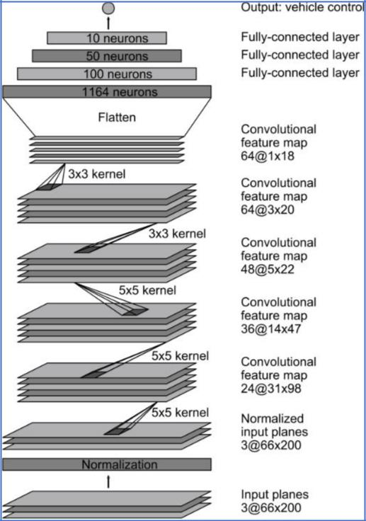

-It uses convolution layers with ReLUs to create non-linearity on the
model and *capture image* *features* at various levels.

-It uses a dropout at the end of the CNN to correct for overfitting.

-it uses 4 fully connected layers acting as a *controller* for the
steering input.

The model was built using Keras. Outputting a summary on Keras \[lines
149-155\] shows a detailed table of the model with sizes:

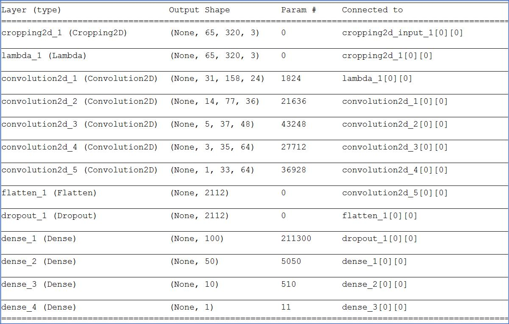

The CNN architecture ends up having 348,219 parameters.

**REDUCE OVERFITTING**

The images were divided into training and validation using sklearn, 80%
and 20% respectively. \[line 85\]

All the convolution layers have Rectifier linear units (ReLUs) to create
nonlinearity. In between the convolution and the fully connected layers
there is a dropout to reduce overfitting. \[line 135\]

**MODEL PARAMETERS**

The Adam optimizer was specified, therefore there is no need of
specifying the learning rate. \[line 141\]

> Loss function specified is MSE for Mean Squared Error. \[line 141\]

> **TRAINING DATA**
>
> The objective of the datasets was to provide imagery data that will
> keep the car on the track. The datasets used were screenshots of the
> simulator driving on a track taken at given intervals. Each timepoint
> has 3 images that correspond to the left/center/right cameras:

  --------------------- ----------------------- ----------------------
                                                
  > LEFT Camera Image   > CENTER Camera Image   > RIGHT Camera Image
                                                
  --------------------- ----------------------- ----------------------

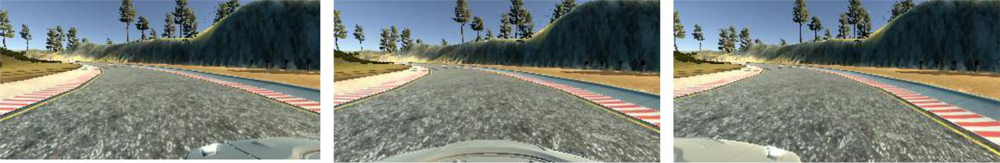

> The training data was obtained by driving the car around the track
> using a joystick, since it was proven difficult to keep the car on
> path using keyboard/mouse.
>
> Since the Udacity data was not enough to train the car correctly,
> additional datasets were collected. The objective when collecting
> datasets was to have a good representation of the track, and a good
> representation of what high steer angles can do (i.e. correct when you
> are close to the edges of the road). These datasets will help the
> model generalize.
>
> To make it easy to swap/add/delete datasets, they were organized into
> different folders. For example: data00 folder has Udacity’s data or
> data05 folder has data focusing on crossing the bridge. The contents
> of the folder are as follows:

  --------------- ---------------------------------
  > DATA FOLDER   > DESCRIPTION
                  
  > data00        > Udacity provided
                  
  > data01        > Driving on center CCW
                  
  > data02        > Side to center correction CCW
                  
  > data03        > Driving on center CW
                  
  > data04        > Side to center correction CW
                  
  --------------- ---------------------------------

  ------------------------------------------------- -------------------------
  > data05   > Bridge (both ways)
                                                    
  > data06                                          > Driving on center CCW
                                                    
  > data10                                          > Track2 CCW
                                                    
  > data11                                          > Track2 CW
                                                    
  ------------------------------------------------- -------------------------

**IMAGE PROCESSING**

The image data is normalized inside the Keras model by using a Lambda
function. (lambda x: x/255.0 - 0.5) \[line 126\]. The distribution then
has zero mean.

Also, the images are cropped inside Keras by 70 pixels from the top and
25 from the bottom. \[line 124\]. The cropped area is shown below in
between the red lines:

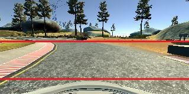

The image cropping made an enormous difference in obtaining a good
model.

A histogram equalizer using CV2 was attempted, but it did not make a
difference on track1, so it was taken out. This was implemented at the
generator level, but taken out.

**DATA AUGMENTATION**

Data augmentation was performed because it was not possible to train the
car to drive correctly with the obtained datasets.

Data augmentation was performed using the left and right cameras (using
a steering factor of 0.08). \[Lines 19, 20, 48-68\] Below is a histogram
showing the histogram before and after camera augmentation:

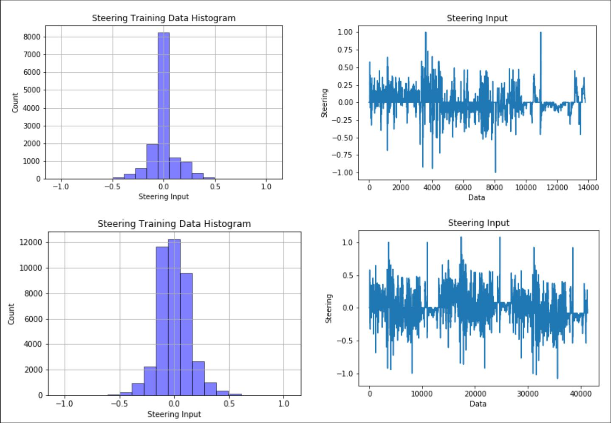

> *Data before and after left/right camera augmentation*

There were 11024 images before augmentation. With left/right camera
augmentation, the images count increased to 3X (33074 images). Better
yet, after camera augmentation, the much better distributed steering
angles resulted on the model driving on the track.

Augmenting by flipping images left to right did not yield better results
for this model/dataset. It was also my decision not to use it, since
most road images are not symmetric (i.e. you drive on the right side of
the road). I decided not to flip L/R to keep the model more realistic.

**GENERATOR**

The generator was implemented as a function. \[lines 87-104\]

Before using the generator, all the images were loaded into memory, this
was ok on a workstation with 24GB of RAM, but the generator was needed
to feed the images on the fly to a computer with low RAM or a GPU such
as AWS. After implementing the generator, I could run on AWS GPU with
much lower memory.

**TRAINING**

The number of epochs was set to 7, after that very little gains and the
validation loss was not stable. This was sufficient to keep the car
stable on the track. \[line 147\]

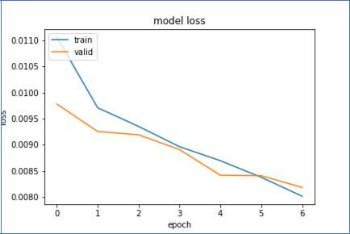

**SIMULATION**

After performing the training, and using the model.h5 on the car
simulator, the car could drive autonomous around the track1 non-stop.

**COMMENTS**

-The car simulator was hardcoded on drive.py to drive around 9mph.
Therefore, when collecting data, I tried to drive my car at around 9mph.
In vehicle dynamics, there is a relationship between response, steer
angle and speed. The faster you go, the less steer you need to move the
car sideways.

-Areas where the car had trouble were:

> -bridge -&gt; because of transition (edges on road vs. edges on
> bridge)

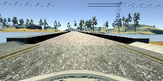

> -dirt road -&gt; there were no sharp edges on road (car went off
> road):

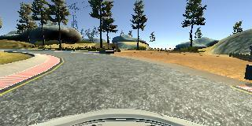

> -sharp turn (not enough high angle steer):

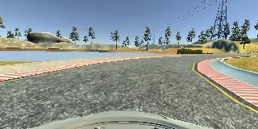

-A good metric to see how well the car does, would be to compile the car
simulator in Unity to give a visual of the path of the car in the track
from above.

-The car perceives shadows as lines/features, this is noticeable when
going under the tree shadows and the car steers out of it:

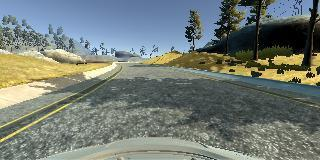

- I tried the Comma.ai published
architecture did not do better than the NVIDIA for this project.

-Other functions that I added on the CNN to test its performance were:

> -ELUs on every layer (no discernable difference compared to NVIDIAs
> architecture)
>
> -Dropout on every layer (no difference)
>
> -L2 penalties (no difference)

-Things I did not try because I ran out of time were: deeper/shallower
networks and batch normalization.

**TRACK TWO**

Data was collected on Track two going clockwise and counterclockwise.
The speed was set at approximately 9mph also.

The architecture implemented was the same as in track one. I also
included the datasets for track1 to try to generalize.

After training on all the data sets, the model behavior was not good, it
was having difficulties with hard shadows and veering off the road. The
CNNs “see” the lines of a shadow as a feature and induce steering. The
image below shows an area where the car had trouble and ended up on the
ditch:

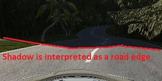

To correct this behavior 2 things could be done:

1-remove shadows. There are some image processing techniques published
but could be difficult and leave some edges that could again cause
errors.

2-add random shadows to the dataset images so that the model generalizes
to driving with shadows and does not consider them a feature that has
correlation with the steer input. This

was done on the code using augment\_shadow = True. **The shadow function
was borrowed** **from the Chatbotlife website.**

After implementing the random shadow augment, the car could drive past
the shadow edge going straight into the mountains.

The next problem then became the very dark areas. I tried to correct
this problem by using, augment\_bright = True on my code.
Augment\_bright enable a function borrowed from Chatbotlife website that
brightened a dark image.

Unfortunately, the problem persists, and I ran out of time with track 2.
So, this point is as far as I got. I look forward to hearing from
Udacity expertise about the techniques to overcome this problem.

Files for model for track2 included in the submission are named:

model\_for\_Track2.py

model\_for\_Track2.h5

model\_for\_Track2.mp4
